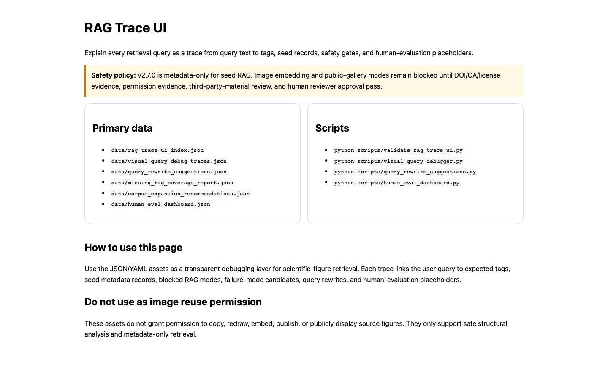
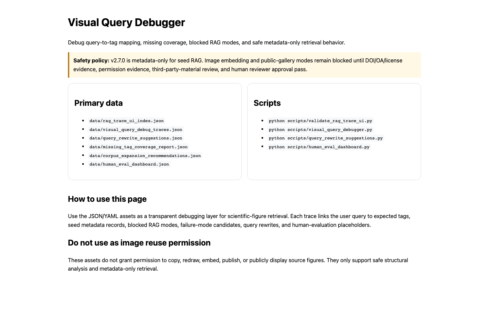
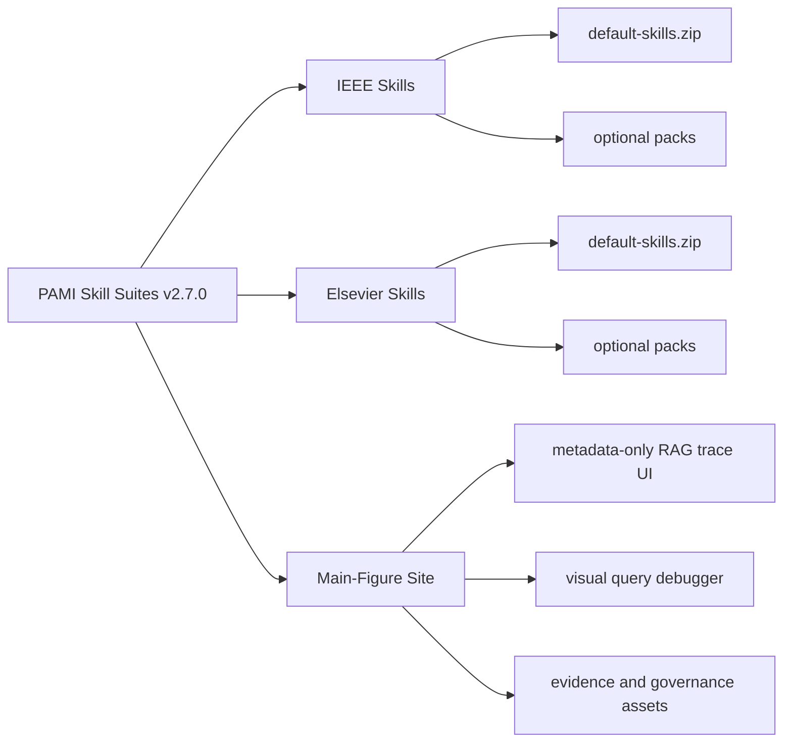

<div align="center">
  

  <h1>PAMI Skill Suites</h1>

  <p><strong>Context-safe academic writing skills for IEEE and Elsevier style journal work, packaged with a metadata-only scientific-figure RAG trace workspace.</strong></p>

  <p>
    <a href="https://github.com/Harzva/pami-skill-suites/releases/tag/v2.7.0"></a>
    <a href="https://harzva.github.io/pami-skill-suites/"></a>
    <a href="./LICENSE"></a>
    <a href="#download"></a>
    <a href="#safety-boundaries"></a>
  </p>

  <p>
    <a href="https://harzva.github.io/pami-skill-suites/">Website</a> ·
    <a href="#download">Download</a> ·
    <a href="#install">Install</a> ·
    <a href="#use">Use</a> ·
    <a href="docs/readme-assets/gallery.html">Visual Gallery</a> ·
    <a href="#validate">Validate</a>
  </p>

</div>

<!-- showcase:start -->
<p align="center">
  
</p>

<p align="center">
  <a href="docs/readme-assets/gallery.html">Open the visual gallery</a>
</p>

| RAG Trace UI | Visual Query Debugger |
| --- | --- |
|  |  |
<!-- showcase:end -->

## What You Get

`pami-skill-suites` is a release bundle for agent-native manuscript work. It is unofficial and not affiliated with IEEE, Elsevier, any journal, society owner, submission system, or publisher platform.

| Suite | Best For | Default Skill Count | Main Entry |
| --- | --- | ---: | --- |
| [`ieee-skills/`](./ieee-skills) | IEEE-style writing, review, response, citations, figures, tables, and submission checks | 8 | `ieee-skill-suite` |
| [`elsevier-skills/`](./elsevier-skills) | Elsevier-style writing, highlights, review, response, citations, figures, tables, and submission checks | 9 | `elsevier-skill-suite` |
| [`main-figure-site/`](./main-figure-site) | Metadata-only scientific-figure retrieval traces, query debugging, evidence cards, and governance dashboards | 0 | Static docs and JSON/YAML assets |

The publisher suites are compact by default. Advanced component packs, presets, RAG governance assets, and visual-pattern resources are optional.

## Download

Release assets are hosted at [v2.7.0](https://github.com/Harzva/pami-skill-suites/releases/tag/v2.7.0).

| Asset | Contents | SHA256 |
| --- | --- | --- |
| [`ieee-skills-v2.7.0.zip`](https://github.com/Harzva/pami-skill-suites/releases/download/v2.7.0/ieee-skills-v2.7.0.zip) | IEEE suite source tree and `dist/*.zip` packages | `a2332de13e95dcbebd85de3ce34670f3bc8c50e8f0561d67a7b98a4e077bfb8f` |
| [`elsevier-skills-v2.7.0.zip`](https://github.com/Harzva/pami-skill-suites/releases/download/v2.7.0/elsevier-skills-v2.7.0.zip) | Elsevier suite source tree and `dist/*.zip` packages | `57d6f49d4ba6a67d71737163fe4ce0b3047cf90c3bb415099e2093869581aa1f` |
| [`main-figure-site-v2.7.0.zip`](https://github.com/Harzva/pami-skill-suites/releases/download/v2.7.0/main-figure-site-v2.7.0.zip) | Static site, metadata-only RAG trace data, and validation scripts | `5144d066d9b224ea44ec0b8c91ee96ac42bdc7dd9c3d12ab3ffacf7f22a520ec` |
| [`journal-skill-suites-v2.7.0.zip`](https://github.com/Harzva/pami-skill-suites/releases/download/v2.7.0/journal-skill-suites-v2.7.0.zip) | Aggregate download containing the three release zips plus release metadata | `6e40bafeecb728b8efa59ad4573b806d0e8a4f3a34ccaae017ff3fa665e51d07` |

Machine-readable release metadata is available in [`journal-skill-suites-v2.7.0-summary.json`](./journal-skill-suites-v2.7.0-summary.json).

## Install

### 1. Download a suite

Install one publisher suite, or use the aggregate archive when you want everything.

```bash
curl -L -o ieee-skills-v2.7.0.zip \
  https://github.com/Harzva/pami-skill-suites/releases/download/v2.7.0/ieee-skills-v2.7.0.zip

unzip ieee-skills-v2.7.0.zip
```

```bash
curl -L -o elsevier-skills-v2.7.0.zip \
  https://github.com/Harzva/pami-skill-suites/releases/download/v2.7.0/elsevier-skills-v2.7.0.zip

unzip elsevier-skills-v2.7.0.zip
```

### 2. Install compact default skills

The recommended starting point is `dist/default-skills.zip`. It contains the small default skill surface without optional expansion packs.

For Codex-style local skills:

```bash
tmpdir="$(mktemp -d)"
unzip ieee-skills/dist/default-skills.zip -d "$tmpdir"
mkdir -p "${CODEX_HOME:-$HOME/.codex}/skills"
cp -R "$tmpdir/default-skills/skills/"* "${CODEX_HOME:-$HOME/.codex}/skills/"
```

For Elsevier:

```bash
tmpdir="$(mktemp -d)"
unzip elsevier-skills/dist/default-skills.zip -d "$tmpdir"
mkdir -p "${CODEX_HOME:-$HOME/.codex}/skills"
cp -R "$tmpdir/default-skills/skills/"* "${CODEX_HOME:-$HOME/.codex}/skills/"
```

Other agent runtimes can install the same `default-skills/skills/*` directories into their own skill/plugin directory.

### 3. Add optional packs only when needed

Use optional packages when the target runtime can handle a larger skill list.

```text
dist/advanced-skills.zip
dist/full-suite.zip
dist/presets.zip
dist/rag-governance.zip
dist/rag-evaluation.zip
dist/rag-trace-ui.zip
```

## Use

Try a publisher suite entry first:

```text
Use ieee-skill-suite to audit this manuscript for IEEE-style structure, evidence gaps, citation integrity, figure/table readiness, and submission risks.
```

```text
Use elsevier-skill-suite to prepare a revision plan, reviewer-response matrix, highlights, declaration checklist, and source-grounded submission reminders.
```

Use focused skills when the task is narrow:

```text
Use ieee-figure-table to review my figures, captions, table structure, and visual accessibility risks.
```

```text
Use elsevier-citation to check citation coverage, source grounding, missing related work, and bibliography consistency.
```

Use the main-figure site for metadata-only retrieval and review workflows:

```bash
cd main-figure-site
python3 scripts/validate_rag_trace_ui.py
open docs/rag-trace-ui.html
```

## Package Map



## Validate

Run publisher-suite validation from either `ieee-skills/` or `elsevier-skills/`:

```bash
make validate
python3 scripts/validate_distribution.py
python3 scripts/validate_release_health.py
python3 scripts/run_smoke_tests.py
```

Run main-figure validation from `main-figure-site/`:

```bash
python3 scripts/validate_main_figure_corpus.py --site .
python3 scripts/validate_rag_trace_ui.py
python3 scripts/validate_visual_query_benchmark.py
python3 scripts/validate_source_discovery.py
```

Final validation reports:

- [`ieee-skills/FINAL_VALIDATION_REPORT.md`](./ieee-skills/FINAL_VALIDATION_REPORT.md)
- [`elsevier-skills/FINAL_VALIDATION_REPORT.md`](./elsevier-skills/FINAL_VALIDATION_REPORT.md)
- [`main-figure-site/FINAL_VALIDATION_REPORT.md`](./main-figure-site/FINAL_VALIDATION_REPORT.md)

## Safety Boundaries

These suites are for manuscript structure, evidence planning, citation hygiene, submission readiness, and metadata-only figure retrieval analysis.

They do not grant permission to copy, redraw, publish, embed, or reuse source figures, tables, captions, labels, layouts, paper-specific claims, restricted full text, private manuscripts, confidential peer review, or unpublished research data.

| Capability | v2.7.0 Status |
| --- | --- |
| Compact writing/review/submission skills | Available |
| Metadata-only seed RAG | Available |
| RAG trace UI and visual query debugger | Available |
| Image embedding RAG | Blocked |
| Public-gallery reuse | Blocked |
| New figure extraction | Blocked until evidence review and human approval pass |
| Live publisher/DOI/OA/license certification | Not claimed |

## Repository Layout

```text
elsevier-skills/                         Elsevier suite source tree
ieee-skills/                             IEEE suite source tree
main-figure-site/                        Static site and metadata-only RAG trace workspace
docs/readme-assets/                      README icon, hero, screenshots, and gallery
journal-skill-suites-v2.7.0-summary.json Release package metadata
showcase.config.json                     Repeatable README screenshot configuration
zip/                                     Local release archives, ignored by Git
```

## License

Repository-owned code and documentation are released under the [MIT License](./LICENSE). Third-party papers, templates, manuals, screenshots, linked resources, or publisher documentation remain governed by their own licenses and terms.
