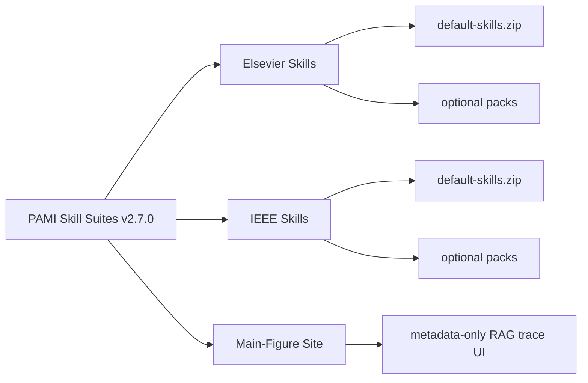

<div align="center">

# PAMI Skill Suites

**Context-safe IEEE and Elsevier journal manuscript skill suites, packaged with a metadata-only scientific-figure RAG trace workspace.**

[](https://github.com/Harzva/pami-skill-suites/releases/tag/v2.7.0)
[](./LICENSE)
[](#validation)
[](#safety-boundaries)
[](#download)

[Download](#download) · [Install](#install) · [Validate](#validation) · [Safety](#safety-boundaries) · [Package Map](#package-map)

</div>

## Why This Exists

`pami-skill-suites` is a public release bundle for agent-native academic writing workflows:

- **IEEE Skills**: compact manuscript, review, response, citation, figure/table, and submission skills for IEEE-style journal work.
- **Elsevier Skills**: compact manuscript, review, response, highlights, citation, figure/table, and submission skills for Elsevier-style journal work.
- **Main-Figure Site**: a standalone metadata-only main-figure gallery and RAG trace/debugging scaffold.

The project is unofficial and is not affiliated with IEEE, Elsevier, any target journal, society owner, submission system, or publisher platform. It does not provide legal advice and does not replace the latest official author instructions.

## Download

Release assets are published on the GitHub release page:

| Asset | Use When You Need | SHA256 |
|---|---|---|
| [`elsevier-skills-v2.7.0.zip`](https://github.com/Harzva/pami-skill-suites/releases/download/v2.7.0/elsevier-skills-v2.7.0.zip) | Elsevier manuscript skill suite | `57d6f49d4ba6a67d71737163fe4ce0b3047cf90c3bb415099e2093869581aa1f` |
| [`ieee-skills-v2.7.0.zip`](https://github.com/Harzva/pami-skill-suites/releases/download/v2.7.0/ieee-skills-v2.7.0.zip) | IEEE manuscript skill suite | `a2332de13e95dcbebd85de3ce34670f3bc8c50e8f0561d67a7b98a4e077bfb8f` |
| [`main-figure-site-v2.7.0.zip`](https://github.com/Harzva/pami-skill-suites/releases/download/v2.7.0/main-figure-site-v2.7.0.zip) | Standalone main-figure gallery and metadata-only RAG scaffold | `5144d066d9b224ea44ec0b8c91ee96ac42bdc7dd9c3d12ab3ffacf7f22a520ec` |
| [`journal-skill-suites-v2.7.0.zip`](https://github.com/Harzva/pami-skill-suites/releases/download/v2.7.0/journal-skill-suites-v2.7.0.zip) | Aggregate package containing the three release zips, README, and summary JSON | Reported on the GitHub Release page |

Machine-readable release metadata is in [`journal-skill-suites-v2.7.0-summary.json`](./journal-skill-suites-v2.7.0-summary.json).

## Package Map

| Package | Default Skills | Release Status | Safety Mode |
|---|---:|---|---|
| [`elsevier-skills/`](./elsevier-skills) | 9 | v2.7.0 validated | Compact default skills, optional packs |
| [`ieee-skills/`](./ieee-skills) | 8 | v2.7.0 validated | Compact default skills, optional packs |
| [`main-figure-site/`](./main-figure-site) | 0 | v2.7.0 validated | Metadata-only RAG scaffold |



## Install

For a compact default install, unzip the publisher package you need and start with:

```text
dist/default-skills.zip
```

Optional workflows live in package-specific `dist/` archives:

```text
dist/advanced-skills.zip
dist/full-suite.zip
dist/presets.zip
dist/rag-governance.zip
dist/rag-evaluation.zip
dist/rag-trace-ui.zip
```

Do not install advanced skills, expansion packs, presets, or main-figure assets as default top-level skills unless the target agent can handle a larger skill listing.

## Validation

Publisher package release gates:

```bash
make all
python3 scripts/build_distribution.py
python3 scripts/validate_distribution.py
python3 scripts/validate_release_health.py
python3 scripts/run_smoke_tests.py
```

Standalone main-figure site gates:

```bash
python3 scripts/validate_main_figure_corpus.py --site .
python3 scripts/validate_candidate_evidence.py
python3 scripts/validate_evidence_promotion.py
python3 scripts/validate_rag_governance.py
python3 scripts/validate_rag_trace_ui.py
python3 scripts/validate_visual_query_benchmark.py
python3 scripts/validate_source_discovery.py
```

Final v2.7.0 validation reports:

- [`elsevier-skills/FINAL_VALIDATION_REPORT.md`](./elsevier-skills/FINAL_VALIDATION_REPORT.md)
- [`ieee-skills/FINAL_VALIDATION_REPORT.md`](./ieee-skills/FINAL_VALIDATION_REPORT.md)
- [`main-figure-site/FINAL_VALIDATION_REPORT.md`](./main-figure-site/FINAL_VALIDATION_REPORT.md)

## Safety Boundaries

Visual assets are for structural analysis only. Do not copy, redraw, publish, embed, or reuse figures, tables, captions, labels, layouts, or paper-specific claims without checking the original license, attribution requirements, third-party material status, and target venue policy.

For v2.7.0:

| Capability | Status |
|---|---|
| Metadata-only seed RAG | Allowed |
| Image embedding RAG | Blocked |
| Public-gallery reuse | Blocked |
| New figure extraction | Blocked until evidence review and human approval pass |
| Live DOI/OA/license certification | Not claimed by this offline release |

This repository should not contain credentials, `.env` values, cookies, raw chat logs, private manuscripts, confidential peer review, unpublished research data, or private local access files.

## Repository Layout

```text
elsevier-skills/                         Editable Elsevier release tree
ieee-skills/                             Editable IEEE release tree
main-figure-site/                        Editable standalone site release tree
journal-skill-suites-v2.7.0-summary.json Release package metadata
zip/                                     Local release archives; not committed
```

## License

MIT for repository-owned code and documentation. Third-party papers, templates, manuals, screenshots, or links referenced by this repository are governed by their own licenses and terms. They are not relicensed by this repository.
